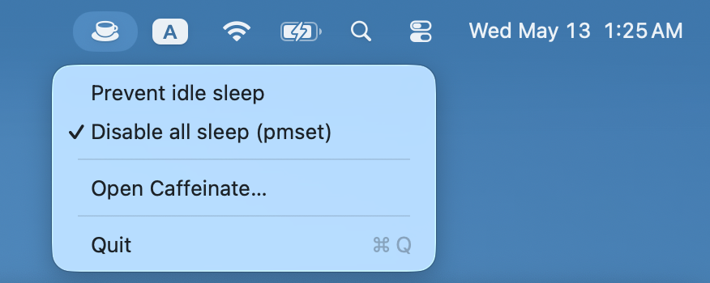
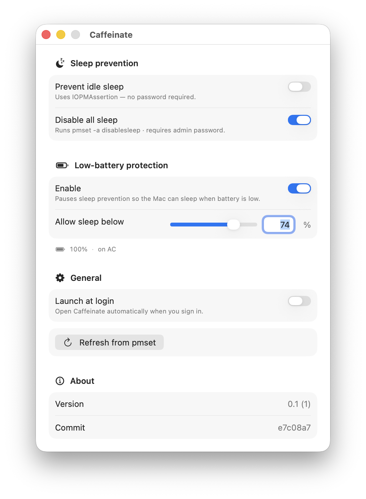

<br clear="left" />

# Caffeinate

macOS menu bar app to keep the Mac awake.





## Features

- **Menu bar + window**: dropdown for quick toggles, window for full settings.
- **Prevent idle sleep**: `IOPMAssertion`, no password, does not persist, and may not work when closes lid.
- **Disable all sleep**: `pmset -a disablesleep 1`, requires admin. Persists across reboots and prevent sleep when closes lid.
- **Low-battery protection**: configurable threshold (default 20%). On battery below threshold, both protections release. Re-applies when plugged in or charged. Uses IOKit power-source notifications.
- **Launch at login**: `SMAppService.mainApp`. Toggle syncs with System Settings on launch.
- Native Swift.

## Install

Release builds are available in the [Releases](https://github.com/gen-xu/caffeinate/releases) page.

## Build

In Xcode: open `caffeinate.xcodeproj` and run.

From the command line (requires `xcode-select` pointed at a full Xcode install, not just the Command Line Tools):

```sh
xcodebuild -project caffeinate.xcodeproj -scheme caffeinate -configuration Release -derivedDataPath build
cp -R build/Build/Products/Release/caffeinate.app /Applications/
```

App Sandbox is already off in the project so the app can launch `pmset` and request admin auth.
